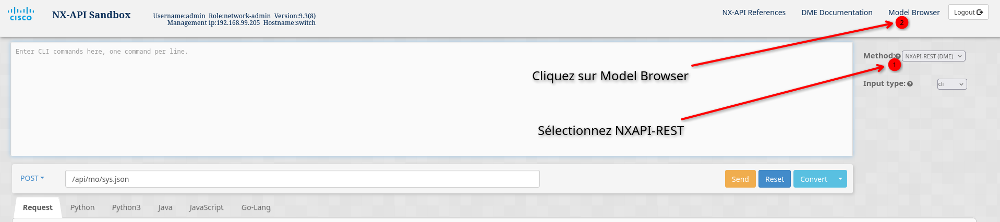
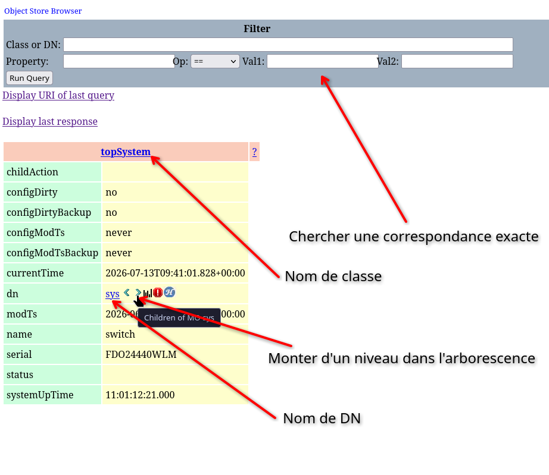
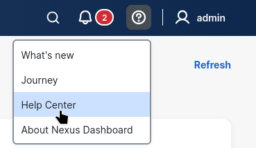
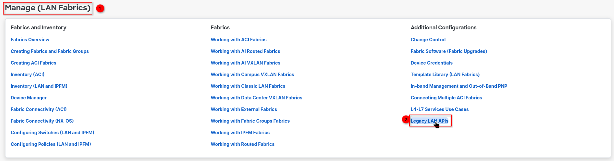

# Prélude: Cas d'usage

## Reset de Switch

Un switch sous NX-OS antérieur à 10.0 peut se réinitialiser de la façon suivante:

### Réinitialisation du mot de passe

1. Éteindre le switch et s'y connecter sur le port serial
2. Appuyer sur CTRL+C continuellement pendant le boot
3. Une fois sur le loader, taper la commande 
```
loader > cmdline recoverymode=1
```
4. Identifier avec `dir` l'image de nxos sur laquelle booter (la plus récente)
5. Utiliser la commande `boot nxos.<version>.bin` pour booter sur nxos
6. Sur le mode `boot` du switch
```
switch(boot)# conf t
switch(boot)(config)# admin-password <mot de passe>
switch(boot)(config)# exit
switch(boot)# load-nxos
```
7. Se connecter avec le username `admin` et le mot de passe choisi.

> **A NOTER** que le démarrage peut prendre du temps, la configuration n'est pas immédiatement accessible.

#### Simple réinitialisation de mot de passe
Si l'on souhaite simplement modifier le mot de passe, il faut l'enregistrer dans la configuration
```
switch# conf t
switch(config)# username admin password <mot de passe>
switch(config)# exit
switch# copy run start
```

### Réinitialisation complète

Une fois l'accès au switch obtenu, on le réinitialise comme suit :
```
switch# conf t
switch(config)# write erase
switch(config)# write erase boot
switch(config)# exit
switch# reload
```

Au redémarrage, le switch va se charger sur le loader. Il faut démarrer sur une image de nxos en utilisant la commande `boot` (les versions disponibles sont visibles via `dir`).

Une fois fait, le switch va boucler sur son processus POAP (Power On Auto Provisioning) ; il cherche une configuration accessible sur le réseau. Il faut taper `yes` pour passer en configuration manuelle.

Procéder ensuite aux configurations manuelles classiques. **Ne pas oublier l'adresse IP du port management et l'accès via SSH.**

Une fois le switch configuré, il faut lui indiquer l'image de boot. **Sinon, le switch redémarre en loader.**
```
switch# conf t
switch(config)# boot nxos.<version>.bin
switch(config)# exit
switch# copy run start
```

## Premier démarrage (connexion HTTP sur Management)

**A NOTER**: Il est aussi possible d'utiliser immédiatement la configuration de base en HTTPS autosigné.

Il faut s'assurer que HTTP est bien en écoute et que le VRF est configuré sur le port management
```
switch# conf t
switch(config)# nxapi http port 80
switch(config)# nxapi use-vrf management
```
Si besoin, sauvegarder la configuration:
```
copy run start
```


## Utilisation du certificat autosigné

Le switch autosigne un certificat par défaut pour permettre une connexion HTTPS.
Il est possible d'importer un certificat de confiance.

```
switch# conf t
switch(config)# nxapi certificate httpscrt certfile bootflash:certificate.crt
switch(config)# nxapi certificate httpskey keyfile bootflash:privkey.key password pass123!
switch(config)# nxapi certificate enable
```

## NXAPI

NXAPI est une **feature** à activer sur les switchs. Une fois cette feature activée, il est possible de la manipuler dans *Developer Sandbox*. Sur celle-ci, il est possible de générer du code dans le langage que l'on souhaite pour scripter ses appels d'API.
Il faut se connecter au switch en HTTPS via un navigateur pour y accéder.

Il existe deux types d'API :
- NXCLI, qui permet d'envoyer des commandes CLI au switch et de recevoir la réponse.
    > Mais cette API est lente et demande une authentification à chaque commande.
- NXREST, une API REST qui permet de vérifier l'état du switch et de modifier certaines configurations.
    > Ces requêtes sont rapides et pratiques pour le monitoring. **On utilise cette API en priorité.**
    > L'API REST ne permet pas de sauvegarder la running-config et de correctement évaluer les niveaux optiques.


### Endpoints

L'API dispose de plusieurs endpoints fournissant des informations différentes :
- `https://<ip_switch>/api/ins` est l'endpoint de **NXAPI-CLI**. Il permet d'envoyer des commandes CLI au switch via `POST` et renvoie un JSON de résultat. Une réponse peut mettre **3 à 5 secondes** avant d'arriver.

La requête contient donc les identifiants d'authentification et son payload :
```json
{
    "jsonrpc": "2.0",
    "method": "cli",
    "params": {
        "cmd": <Commande CLI à envoyer au switch>,
        "version": 1
    },
    "id": 1
}
```

Il existe également des endpoints de type `GET` accessibles via NXAPI-REST, permettant de récupérer des données du switch :
- `https://<ip_switch>/api/mo/sys.json` renvoie les informations du switch, notamment son nom, son uptime, etc.
- `https://<ip_switch>/api/class/ethpmPhysIf.json` renvoie l'état des interfaces, notamment si elles sont **UP** ou **DOWN** administrativement et opérationnellement. On peut aussi voir si les interfaces sont en full ou half-duplex.
- `https://<ip_switch>/api/class/rmonEtherStats.json` renvoie les statistiques des interfaces. Il s'agit de tous les compteurs: CRC, paquets perdus, etc.

### Comment trouver de nouveaux endpoints ?

Pour identifier les endpoints d'API à utiliser, il faut se connecter à la sandbox de NXAPI:  
Sur le navigateur, entrez `https://<ip_switch>` et renseignez les identifiants de connexion.

#### Pour l'API CLI

Le endpoint est toujours `https://<ip_switch>/api/ins`, en revanche, les JSON de retour peuvent être vus sur la page "Command Reference" en haut à droite.


#### Pour l'API REST
Pour commencer, sélectionnez la méthode NXAPI-REST puis entrez dans le "Model Browser".  





La version REST de NXAPI fonctionne comme une arborescence, avec différents niveau de précision. Elle donne des informations valables à l'instant de la requête.

Vous entrez par défaut au niveau de la classe `topSystem`, qui donne des informations sur l'état du switch. Pour obtenir des informations plus abstraites, il faut aller au niveau antérieur au `topSystem`, vous pouvez faire cela en cherchant la classe `topRoot` dans le filtre "Class or DN" (ou en laissant le champ vide).



A partir de là, vous pouvez faire `CTRL+F` et tapez des mots clés comme `eth` ou `ptp` pour trouver des endpoints ou des informations spécifiques.
Si vous ne voyez pas ce que vous cherchez, descendez dans l'arboresecnce en cliquant sur les flèches au niveau des DN.

Une fois que vous avez trouvez les données que vous cherchez, vous pouvez identifier l'endpoint de deux manières différentes:

- **Par classe:** Le nom d'une classe est indiqué dans le carré orange. Ainsi, l'endpoint à adresser est `https://<ip_switch>/api/class/<nom_de_classe>.json` (C'est cette méthode que le script utilise couramment)

- **Par DN:** Le nom de DN est indiqué dans la section prévue à cet effet dans le tableau. Ainsi l'endpoint à adresser est `https://<ip_switch>/api/mo/<nom_de_dn>.json`

Ces deux méthodes sont stictement équivalentes. Cela signifie par exemple que, dans l'image précédente, les réponses de
- `GET https://<ip_switch>/api/class/topSystem.json`
- `GET https://<ip_switch>/api/mo/sys.json`  

Sont strictement les mêmes.

Pour compléter vos recherches, vous aurez probablement besoin de consulter l'[APIC Object Model Documentation](https://developer.cisco.com/docs/apic-mim-ref-321/) de Cisco pour savoir quels sont les retours possibles de chaque éléments du JSON.

Dans le menu de gauche, sélectionnez "All packages" pour fair eune recherche sur l'intégralité des paquets disponibles sur l'API. 

**Exemple**: Si on souhaite en savoir plus sur les retours possibles du JSON de la classe `ethpmIfPhys`:
- On clique sur All Packages à gauche
- On recherche `ethpm`
- On clique sur `Class (ethpm)` à gauche
- On cherche `ethpm:PhysIf`

## NDFC

Pour modifier la configuration des switchs, comme certain sont gérés sur NDFC, il faut modifier la configuration directement sur celui-ci et donc utiliser l'API.  
L'authentification se fait sur le endpoint `https://<ip_ndfc>/login`, où il faut envoyer le payload suivant en `POST`:

```json
{
    "domain": "local",
    "userName": "<nom_utilisateur_ndfc>",
    "userPasswd": "<mot_de_passe_ndfc>"
}
```

NDFC répondra avec un **jwttoken** qu'il faudra inclure à chaque requête dans un header de la forme
```json
{
    "Authorization": "Bearer <jwttoken>"
}
```

Pour faire un management switch par switch, il faut consulter la documentation legacy (l'API Swagger actuelle permet surtout le déploiement de configuration sur tout une fabrique plutôt qu'un seul switch)

Pour consulter la documentation il faut aller dans `Help Center > Lan Fabric > Legacy LAN APIs`





# Utilisation du script

Le script a pour vocation d'être un cronjob. Il prend en entrée les tests à réaliser et renvoie en sortie un fichier de log et de résultats pour faciliter l'intervention.

## Premier démarrage

Le script est compatible avec Python 3.10+ (3.11 recommandé). Assurez-vous d'avoir `pip` installé.
1. Placez-vous à la racine du projet.
2. Initialisez un environnement virtuel :
```bash
python -m venv .venv
```
3. Démarrez l'environnement virtuel.

Sur **Windows** :
```powershell
.venv\Scripts\activate.ps1
```
Sur **Linux** ou **macOS** :
```zsh
source .venv/bin/activate
```

4. Installez les dépendances :
```bash
pip install -r requirements.txt
```

## Utilisation courante

Avant toute chose, assurez-vous :
1. D'avoir **démarré votre environnement virtuel Python**.
2. D'avoir un fichier `.env` à la racine du projet contenant les identifiants des switchs à contacter :
```env
SWITCH_USER_ID=nom_d_utilisateur
SWITCH_PASSWORD=mot_de_passe
NDFC_URL=https://ip_ndfc
NDFC_USER=nom_NDFC
NDFC_PASSWORD=mot_de_passe_NDFC
```
Les sections NDFC sont facultatives.  
Vous pourrez ensuite lancer le programme avec :
```
python main.py -h
```
Vous aurez le manuel qui s'affiche, avec les différents arguments.

```
usage: main.py [-h] [-u N auto_down] [-d] [-e] [-t {WARN,ALERT}]
               [-c critical_delta reference_directory_path]
               [-p since log_level critical_correction]
               [--timeout TIMEOUT]
               [--demo_path demo_directory_path]
               switch_ip_list log_dir_path result_dir_path

A program to maintain Cisco switches through NX-API calls

positional arguments:
  switch_ip_list        The file containing all the switch ips (separated by a
                        newline)
  log_dir_path          The directory on where to store logs of the program
  result_dir_path       The directory on where to store results of the program

options:
  -h, --help            show this help message and exit
  -u, --unused_ports N auto_down
                        Check for DOWN ports unused since N days. Use
                        auto_down=0 to not automaticlly set the associated
                        interfaces as admin_down, auto_down=1 to down the
                        interfaces DIRECTLY on the switch, auto_down=2 to down
                        the interfaces via NDFC only, and auto_down=3 to try
                        to down the interfaces via NDFC and fallback to a down
                        the interfaces DIRECTLY on the switch
  -d, --half_duplex     Check for interfaces running in half duplex mode
  -e, --err_disabled    Check for interfaces that are disabled due to an error
  -t, --check_transceivers {WARN,ALERT}
                        Check transceivers hardware and notify for issues
                        higher or equal to specified level
  -c, --CRC critical_delta reference_directory_path
                        Check for additional cRC and Align errors according to
                        the reference directory
  -p, --PTP since log_level critical_correction
                        Check for abnormal PTP activity. Use log_level=0 to
                        never output PTP logs, log_level=1 to output only on
                        abnormal activity and log_level=2 to always output
  --timeout TIMEOUT     Timeout in seconds for each NX-API and NDFC request
  --demo_path demo_directory_path
                        Enable demo and read local files instead of switch
                        API. For testing purposes only.
```

### Arguments

#### Obligatoires

- `switch_ip_list`: La liste des adresses IP des switchs à monitorer, séparée par une nouvelle ligne.
- `log_dir_path`: Le chemin d'accès du répertoire dans lequel stocker les fichiers de logs.
- `result_dir_path`: Le chemin du répertoire dans lequel stocker les fichiers de résultats pour les interventions.


#### Optionnels

- `--unused_ports N auto_down`: Vérifie l'existence de ports **DOWN** qui ne sont pas administrativement down depuis plus de `N` jours. Si `auto_down=0` cette commande ne fait que vérifier l'existence de ports inutilisés, `auto_down=1` fera un shutdown sur le switch **directement**, `auto_down=2` le fera sur NDFC, et `auto_down=3` tentera de shutdown sur NDFC mais si le switch ***"n'est pas administré par NDFC"***, le shutdown se fera **directement** sur le switch.

> **/!\\** Le programme considère qu'un switch ***"n'est pas administré par NDFC"*** lorsqu'il n'existe pas d'*intent-interface*. Il est possible que cette information soit eronnée. Le mieux est de bien séparer les switchs adminstrés par NDFC de ceux qui ne le sont pas et de sélectionner le type de shutdown automatique en conséquence.

- `--half_duplex`: Vérifie l'existence d'interfaces **UP** qui fonctionnent en half-duplex (au lieu de full-duplex).
- `--err-disabled`: Vérifie les interfaces qui ont été désactivées à cause d'une erreur
- `--check_transceivers {WARN, ALERT}`: Vérifie l'état matériel des transceivers et renvoie les erreurs satisfaisant au moins le niveau spécifié (`WARN` ou `ALERT`).
- `--CRC critical_delta reference_directory_path`: Contrôle les statistiques CRC des interfaces par rapport au dossier de référence `reference_directory_path` spécifié. Affiche des erreurs **CRITICAL** si les compteurs ont augmenté d'au moins `critical_delta`.
> Si le dossier de référence spécifié ne contient pas de référence, le programme va les générer automatiquement, et considère que les compteurs commencent à 0.
- `--PTP since log_level critical_correction`: Contrôle les corrections et les changements de Grandmaster et si tous les switchs sont synchronisés au même endroit. Vérifie que les corrections ne dépassent pas le seuil de `critical_correction` exprimé en nanosecondes. Vérifie les logs de changement jusqu'à `since` jour. Si `log_level=2` les logs PTP sont affichés dans le fichier résultats dans tous les cas, si `log_level=1` seulement en cas d'erreurs, et si `log_level=0` les logs ne sont jamais affichés.  
- `--timeout TIMEOUT`: Définit le délai maximum, en secondes, pour chaque requête NX-API et NDFC.
- `--demo_path demo_directory_path`: Pour réaliser des tests, vérifie les valeurs renseignées dans le `demo_directory_path` plutôt que de s'adresser aux switchs.


### Exemple d'output
On exécute le programme avec
```bash
python main.py switch_ips.txt outputs/logs/ outputs/results/ --unused_ports 90 0 --check_transceivers WARN --half_duplex --CRC 5 references_data/
```
On obtient, par exemple, le résultat suivant:
```
=============[ Switch: spine (10.10.10.1 | SERIAL: 9XMBCLBQDFX) ]=============

> The following ports are unused since 90 days
	- eth1/97
Consider unplugging or disabling them to not be notified again.

> CRITICAL: The following interfaces are running in half duplex
	- eth1/107

> The following transceivers show hardware issues:
	- Interface: Ethernet1/2
		+ ALERT: Transceiver current exceeded the threshold ! (0.0 < 2.0)
		+ CRITICAL: Lane 1 is not plugged in !!!
		+ CRITICAL: Lane 2 is not plugged in !!!
		+ CRITICAL: Lane 3 is not plugged in !!!
		+ CRITICAL: Lane 4 is not plugged in !!!

	- Interface: Ethernet1/3
		+ ALERT: Transceiver temperature exceeded the threshold ! (67.0°C > 65.0°C)
		+ ALERT: Transceiver current exceeded the threshold ! (0.0 < 2.0)
		+ CRITICAL: Lane 1 is not plugged in !!!
		+ CRITICAL: Lane 2 is not plugged in !!!
		+ CRITICAL: Lane 3 is not plugged in !!!
		+ CRITICAL: Lane 4 is not plugged in !!!

	- Interface: Ethernet1/23
		+ WARN: Transceiver voltage exceeded the threshold ! (3.48 > 3.46)
		+ ALERT: Transceiver current exceeded the threshold ! (11.0 > 10.0)
		+ WARN: Lane 1 transfer power has exceeded the threshold ! (-7.02 < -6.0)
		+ ALERT: Lane 2 receive power has exceeded the threshold ! (7.0 > 6.99)

> The following interfaces shows additional cRC or Align errors compared to the last check
	- eth1/97 shows 3 new errors (now 61, was 58)
	- CRITICAL: eth1/99 shows 15 new errors (now 15, was 0)
	- eth1/102 shows 2 new errors (now 4, was 2)
	- CRITICAL: eth1/103 shows 20 new errors (now 20, was 34 and reset since)

================================================

=============[ Switch: leaf (10.10.10.2 | SERIAL: 9XMBCLBLMPO) ]=============
[...]
```

## Avec Docker

## Avec Docker

Le script est fourni avec un `Dockerfile` et peut donc être exécuté facilement dans un conteneur Docker. Ainsi, il peut être déployé sur plusieurs machines pour faire des analyses en parallèle.

Récupérez ce conteneur directement depuis [Docker Hub](https://hub.docker.com/r/wilhembk/cisco-nxapi-wrapper):
```bash
docker pull wilhembk/cisco-nxapi-wrapper
```
Ou bien vous pouvez aussi le construire directement, en étant dans le dossier de travail:
```bash
docker build -t cisco-nxapi-wrapper .
```

### Configuration nécessaire

Comme pour une utilisation normale, vous aurez besoin d'un fichier `.env` de la forme suivante :
```env
SWITCH_USER_ID=nom_d_utilisateur
SWITCH_PASSWORD=mot_de_passe
NDFC_URL=https://ip_ndfc
NDFC_USER=nom_NDFC
NDFC_PASSWORD=mot_de_passe_NDFC
TZ=Europe/Paris
```

On rajoute la mention `TZ` pour que le conteneur **soit à la bonne heure**. Cela permet de générer des logs avec des timestamps cohérents, ainsi que d'assurer la cohérence des tests temporels (PTP, ports inutilisés, ...).

Il nous faudra aussi **obligatoirement**:
- un fichier contenant les adresses IP des switchs à contacter
- le dossier dans lequel stocker les logs
- le dossier dans lequel stocker les résultats

Et **facultativement**:

- le dossier de référence pour les erreurs CRC
- un dossier de démo si l'on souhaite tester des fonctionnalités


### Exécution

#### Petit point sur les volumes

Sur Docker, il faut créer des volumes pour pouvoir créer des dossiers partagés entre l'hôte et le conteneur. On peut les créer avec le paramètre `-v` de la commande `docker run`:

```bash
docker run -v "/chemin/sur/hote:/chemin/sur/container"
```
Ainsi, le fichier `/chemin/sur/hote` de la machine hôte est accessible sur le conteneur sous le nom de `chemin/sur/container`.
**Ces fichiers sont partagés entre l'hôte et le conteneur.**

> **/!\\** Il faut bien indiquer le chemin d'accès complet du fichier sur la machine hôte, ou bien utiliser le `.` pour préciser un chemin relatif. Docker considère par défaut que tous les fichiers viennent de la racine `/`.

#### Exemple

On utilise donc la commande `docker run`. On **ajoute le paramètre** `--rm` pour supprimer le conteneur à la sortie du programme (comme il s'agit juste d'une application CLI, conserver le conteneur ne sert à rien une fois que le travail est fini).

Voici un exemple d'exécution avec tous les paramètres (sauf les paramètres de démo):

```bash
docker run --rm --env-file /chemin/du/.env \
    -v "/chemin/switch_ips.txt:/data/switch_ips.txt" \
    -v "/chemin/du/dossier/outputs:/outputs" \
    -v "chemin/du/dossier/references/CRC:/data/references_data" \
    cisco-nxapi-wrapper:latest \
    /data/switch_ips.txt /outputs/logs /outputs/results \
    --unused_ports 90 0 --half_duplex --err_disabled --check_transceivers WARN  \
    --CRC 5 /data/references_data --PTP 2 1 500 --timeout 30
```

> Dans cette commande, il est possible de retirer le volume des valeurs de référence du CRC, si l'on ne souhaite pas tester le CRC.

Ainsi, les arguments sont les mêmes que ceux à passer au programme Python de base, et les chemins d'accès des fichiers doivent correspondre au chemin d'accès sur le conteneur (et non pas à ceux de la machine hôte).

Il est donc possible de remplacer ces chemins d'accès par d'autres et de permettre une parallélisation des tests de switchs.

# Pour les développeurs

Le programme est développé pour Python 3.10+ (3.11 recommandé) et suit une logique de programmation objet qui le rend modulable:


Il existe aussi la classe `NDFC_API` qui permets de modifier la config des switchs via NDFC. En particulier, elle est actuellement utilisée pour shutdown les ports inutilisés.

Pour développer, il est recommandé d'utiliser [uv](https://docs.astral.sh/uv/) pour gérer convenablement les dépendances et l'environnement virtuel.
 
## Contacter un endpoint 

Pour ajouter un point de contacter à endpoint. On procède en 5 étapes

### Étape 1: Identification du besoin

**Questions** :
- Est-ce qu'on peut utiliser l'API REST, ou est-ce qu'on doit plutôt utiliser l'API CLI ?
  - Si c'est l'**API REST**, on modifie la classe `NXREST-API` de `nxapi_requests.py`.
  - Si c'est l'**API CLI**, on modifie la classe `NXCLI-API` de `nxapi_requests.py` et on utilise la méthode `_wrap_cmd()` pour envoyer la commande au switch.
- Est-ce un `POST` ou un `GET` ?
  - Si c'est un `GET`, on utilise la méthode `_get` et on renseigne l'endpoint (sans le `/api`).
  - Si c'est un `POST`, il faut regarder le résultat du sandbox NXAPI pour avoir une idée de la structure.
- Si on modifie une configuration, est-ce que cela va avoir une incidence de synchronisation avec NDFC ? On modifie autant que possible via l'API NDFC (définie dans `ndfc_requests.py`)

On vérifie le format de retour de l'endpoint avec le sandbox de NXAPI (trouver l'IP d'un switch et s'y connecter via le navigateur).

Le répertoire `demo_json/` contient des JSON qui représentent les endpoints de NXAPI.  
A l'intérieur, les sous-dossiers décrivent des ip de switchs, et dans ces sous-dossiers est retranscrit larborescence de NXAPI.   
Si vous avez besoin d'accéder à de nouveaux endpoints, vous pouvez copier le résultat de la sandbox de NXAPI et les ajouter à `demo_json/` en respectant le chemin d'URL (par ex. `https://<switch_ip>/api/mo/sys.json` se transforme en `demo_json/<switch_ip>/mo/sys.json`).  
Ainsi, vous pourrez tester des cas de monitoring spécifique en changeant ce fichier.


### Étape 2: Écriture dans le fichier de résultat

Dans le fichier `result_file.py` :

1. Créez un nouveau `Label` correspondant à ce que vous souhaitez monitorer (et ajoutez-le dans le fichier résultat).
2. Créez un nouvel objet qui hérite de la classe abstraite `ResultOutput`. Utilisez la structure de données la plus propice pour récupérer les données de monitoring.
3. Créez la méthode `write` de votre objet, qui prend la fonction `output` en paramètre. Considérez cette fonction comme l'équivalent de `print` qui renverra tout dans le fichier de résultat.
> Votre objet sera géré dans la classe `ResultFile`. La fonction d'output qui est passée en paramètre y est définie par `_output`. Vous n'avez pas besoin de la modifier.
4. Ajoutez votre objet dans la gestion du `ResultFile` dans le dictionnaire `switch_outputs[<ip_du_switch>][<Label du monitoring>]`. Votre objet sera automatiquement géré par `ResultFile` une fois fait.
> Il est recommandé d'utiliser la fonction `_init_dict(ip_addr)` où `ip_addr` est l'IP du switch, pour être sûr que le dictionnaire dispose bien d'une entrée correspondant au switch.
5. Si besoin, créez des méthodes pour alimenter votre objet au fur et à mesure de votre monitoring.


### Étape 3: Formatage de la réponse

La réponse d'un `GET` sur l'API REST est **toujours** composée d'un `"total_count"` à la racine qui contient le nombre de résultats renvoyés par le switch. S'il vaut `0`, alors il n'y a rien à traiter, et on devrait s'arrêter immédiatement pour éviter tout plantage.

Avec [glom](https://glom.readthedocs.io/en/latest/tutorial.html), il est possible de récupérer rapidement des données formatées en `JSON`. Des exemples sont disponibles dans le code et sur le manuel de `glom`.

Une fois la réponse correctement formatée, on peut commencer à réaliser des tests de monitoring.
> Si des données utilisateurs sont nécessaires pour pouvoir réaliser ces tests, ajoutez ces variables dans la fonction qui s'occupe de faire le monitoring.

- Utilisez la variable `result` pour communiquer avec le `ResultFile` et envoyer vos résultats à l'objet de monitoring que vous avez précédemment créé.
- Utilisez la variable `logger` pour communiquer avec le `Logger` (défini dans `utils.py`) et la méthode `log` pour journaliser vos actions dans le fichier de log.
> Ces objets sont créés dans `main.py` en fonction de l'entrée utilisateur et passés dans les objets de connexion à NXAPI via `switch_connection.py`. Vous n'avez pas besoin de les modifier.

### Étape 4: Ajout de la fonction de monitoring à `switch_connection.py`

Comme l'objet `SwitchConnection` fait le lien entre l'API REST et l'API CLI, la fonction de monitoring doit être accessible via cet objet.

- Si votre méthode de monitoring utilise l'API REST, utilisez la variable `rest` pour appeler votre fonction.
- Si votre méthode de monitoring utilise l'API CLI, utilisez la variable `cli` pour appeler votre fonction.
> Il est recommandé d'utiliser le même nom de fonction dans `SwitchConnection` que celui choisi dans les objets NXAPI pour éviter les confusions.


### Étape 5: Parsing des entrées utilisateurs dans `main.py`

La bibliothèque Python native [argparse](https://docs.python.org/3/library/argparse.html) rend cette partie très facile :

- Ajoutez une option avec `parser.add_argument` (dans le bloc `if __name__ == "__main__"` en bas du fichier).
  - Renseignez la section `help` pour documenter ce que fait votre monitoring.
- Dans la fonction `main` définie en haut du fichier, utilisez `args` pour récupérer les données de votre argument et faites appel à la méthode de `SwitchConnection` précédemment définie.


### Exemple complet: ajouter un monitoring "example_check"

Voici un petit exemple concret montrant comment ajouter le monitoring `example_check` qui récupère un endpoint REST et écrit le résultat dans le fichier de résultat.

1. `result_file.py`: Ajoutez un `Label` et un `ResultOutput`

```python
# result_file.py
class Label(Enum):
  ...
  EXAMPLE_CHECK = "example"

class ExampleCheck(ResultOutput):
    def __init__(self, data):
        self.data = data

    def write(self, output):
        output(f"> Example check:\n")
        output(f"\t- value: {self.data}\n\n")

class ResultFile:
    ...
    def set_example_check(self, ip_addr: str, data):
        self._init_dict(ip_addr)
        self.switch_outputs[ip_addr][Label.EXAMPLE_CHECK] = ExampleCheck(data)
```

2. `nxapi_requests.py`: Ajoutez la méthode de monitoring et envoyez les données à `result`

```python
# nxapi_requests.py
class NXAPI_REST:
    ...
    def get_example_metric(self):
        data = self._get("class/myExample.json")
        value = glom(data, ("imdata", ["myExample.attributes.value"]))[0]
        self.result.set_example_check(self.switch_ip, value)
        return value
```

3. `switch_connection.py`: Ajoutez la méthode de monitoring à `SwitchConnection` pour y faire appel dans `main.py`

```python
# switch_connection.py
class SwitchConnection:
    ...
    def get_example_metric(self):
        return self.rest.get_example_metric()
```

4. `main.py`: Ajoutez une nouvelle option au programme avec argparse et appelez votre méthode de monitoring

```python
# main.py
def main(args)
    ...
    if args.example_check != None:
        sw.get_example_metric()
    ...

if __name__ == "__main__":
    ...
    parser.add_argument("--example_check", action="store_true", help="Run example check")
    ...
```
